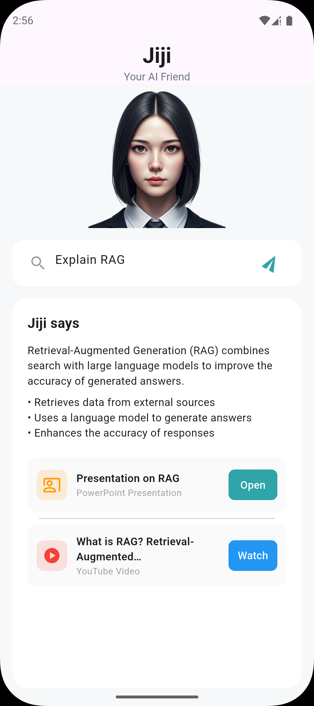

# Jiji

Jiji Assist UI – Flutter Assignment.

A single-screen Flutter UI built for the **Learn with Jiji** assignment.  
This project focuses on clean UI, reusable components, and scalable state management.

---

## 📸 Screenshots

Application screenshots are available in the folder below:

android_apk_demo/

```md

```

````

---

## 📦 Download APK

You can download and install the Android APK from here:

```md
[Download Jiji APK](android_apk_demo/jiji.apk)
```

---

## 🛠 Tech Stack

- Flutter
- flutter_bloc (Cubit)
- equatable

---

## 🧩 Architecture

- Single-screen UI
- Cubit for state management
- Reusable widgets
- TextEditingController used for future feature expansion

---

## 🚀 Run Locally

```bash
flutter pub get
flutter run
```

Build APK:

```bash
flutter build apk
```

---

## 📝 Notes

- UI-only implementation
- No backend or network calls
- Structured for easy future upgrades

```
````
